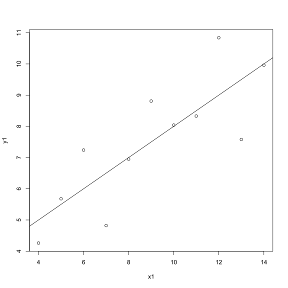

Hello Octocat
-------------

I love Octocat. She's the coolest cat in town.

    data("anscombe")
    dim.data.frame(anscombe)

    ## [1] 11  8

    colnames(anscombe)

    ## [1] "x1" "x2" "x3" "x4" "y1" "y2" "y3" "y4"

    head(anscombe)

    ##   x1 x2 x3 x4   y1   y2    y3   y4
    ## 1 10 10 10  8 8.04 9.14  7.46 6.58
    ## 2  8  8  8  8 6.95 8.14  6.77 5.76
    ## 3 13 13 13  8 7.58 8.74 12.74 7.71
    ## 4  9  9  9  8 8.81 8.77  7.11 8.84
    ## 5 11 11 11  8 8.33 9.26  7.81 8.47
    ## 6 14 14 14  8 9.96 8.10  8.84 7.04

    tail(anscombe)

    ##    x1 x2 x3 x4    y1   y2   y3    y4
    ## 6  14 14 14  8  9.96 8.10 8.84  7.04
    ## 7   6  6  6  8  7.24 6.13 6.08  5.25
    ## 8   4  4  4 19  4.26 3.10 5.39 12.50
    ## 9  12 12 12  8 10.84 9.13 8.15  5.56
    ## 10  7  7  7  8  4.82 7.26 6.42  7.91
    ## 11  5  5  5  8  5.68 4.74 5.73  6.89

    summary(anscombe)

    ##        x1             x2             x3             x4    
    ##  Min.   : 4.0   Min.   : 4.0   Min.   : 4.0   Min.   : 8  
    ##  1st Qu.: 6.5   1st Qu.: 6.5   1st Qu.: 6.5   1st Qu.: 8  
    ##  Median : 9.0   Median : 9.0   Median : 9.0   Median : 8  
    ##  Mean   : 9.0   Mean   : 9.0   Mean   : 9.0   Mean   : 9  
    ##  3rd Qu.:11.5   3rd Qu.:11.5   3rd Qu.:11.5   3rd Qu.: 8  
    ##  Max.   :14.0   Max.   :14.0   Max.   :14.0   Max.   :19  
    ##        y1               y2              y3              y4        
    ##  Min.   : 4.260   Min.   :3.100   Min.   : 5.39   Min.   : 5.250  
    ##  1st Qu.: 6.315   1st Qu.:6.695   1st Qu.: 6.25   1st Qu.: 6.170  
    ##  Median : 7.580   Median :8.140   Median : 7.11   Median : 7.040  
    ##  Mean   : 7.501   Mean   :7.501   Mean   : 7.50   Mean   : 7.501  
    ##  3rd Qu.: 8.570   3rd Qu.:8.950   3rd Qu.: 7.98   3rd Qu.: 8.190  
    ##  Max.   :10.840   Max.   :9.260   Max.   :12.74   Max.   :12.500

    ##    x1 x2 x3 x4    y1   y2    y3    y4
    ## 1  10 10 10  8  8.04 9.14  7.46  6.58
    ## 2   8  8  8  8  6.95 8.14  6.77  5.76
    ## 3  13 13 13  8  7.58 8.74 12.74  7.71
    ## 4   9  9  9  8  8.81 8.77  7.11  8.84
    ## 5  11 11 11  8  8.33 9.26  7.81  8.47
    ## 6  14 14 14  8  9.96 8.10  8.84  7.04
    ## 7   6  6  6  8  7.24 6.13  6.08  5.25
    ## 8   4  4  4 19  4.26 3.10  5.39 12.50
    ## 9  12 12 12  8 10.84 9.13  8.15  5.56
    ## 10  7  7  7  8  4.82 7.26  6.42  7.91
    ## 11  5  5  5  8  5.68 4.74  5.73  6.89

Assignment 4
------------

    ## Analgesic
    rm("anscombe")
    library(readr)

    ## Warning: package 'readr' was built under R version 3.3.3

    df <- read_csv("analgesic.csv")

    ## Parsed with column specification:
    ## cols(
    ##   ID = col_integer(),
    ##   Group = col_character(),
    ##   Measurement_1 = col_integer(),
    ##   Measurement_2 = col_integer(),
    ##   Measurement_3 = col_integer()
    ## )

    #exploring dimensions of dataframe
    dim.data.frame(df)

    ## [1] 40  5

    #Column names
    colnames(df)

    ## [1] "ID"            "Group"         "Measurement_1" "Measurement_2"
    ## [5] "Measurement_3"

    #The fist and last six lines
    head(df)

    ## # A tibble: 6 × 5
    ##      ID     Group Measurement_1 Measurement_2 Measurement_3
    ##   <int>     <chr>         <int>         <int>         <int>
    ## 1     1 Analgesic            26            26            21
    ## 2     2 Analgesic            29            26            23
    ## 3     3 Analgesic            24            28            22
    ## 4     4 Analgesic            25            22            24
    ## 5     5 Analgesic            24            28            23
    ## 6     6 Analgesic            22            23            26

    tail(df)

    ## # A tibble: 6 × 5
    ##      ID   Group Measurement_1 Measurement_2 Measurement_3
    ##   <int>   <chr>         <int>         <int>         <int>
    ## 1    35 Placebo            17            21            15
    ## 2    36 Placebo            19            17            15
    ## 3    37 Placebo            14            19            13
    ## 4    38 Placebo            17            19            13
    ## 5    39 Placebo            11            20            18
    ## 6    40 Placebo            15            18            12

    #statistical summary of each column
    summary(df)

    ##        ID           Group           Measurement_1   Measurement_2 
    ##  Min.   : 1.00   Length:40          Min.   :10.00   Min.   : 8.0  
    ##  1st Qu.:10.75   Class :character   1st Qu.:17.00   1st Qu.:17.0  
    ##  Median :20.50   Mode  :character   Median :20.00   Median :20.0  
    ##  Mean   :20.50                      Mean   :20.12   Mean   :20.7  
    ##  3rd Qu.:30.25                      3rd Qu.:24.00   3rd Qu.:25.0  
    ##  Max.   :40.00                      Max.   :30.00   Max.   :32.0  
    ##  Measurement_3  
    ##  Min.   :12.00  
    ##  1st Qu.:16.00  
    ##  Median :20.50  
    ##  Mean   :20.52  
    ##  3rd Qu.:24.25  
    ##  Max.   :30.00

    library(tidyr) # to tidy data
    df2 <- gather(df, methods, pain_scores, Measurement_1:Measurement_3)
    library(dplyr) # to manipulate data

    ## 
    ## Attaching package: 'dplyr'

    ## The following objects are masked from 'package:stats':
    ## 
    ##     filter, lag

    ## The following objects are masked from 'package:base':
    ## 
    ##     intersect, setdiff, setequal, union

    df2 %>%
      group_by(ID) %>%
      summarise(avg = mean(pain_scores))

    ## # A tibble: 40 × 2
    ##       ID      avg
    ##    <int>    <dbl>
    ## 1      1 24.33333
    ## 2      2 26.00000
    ## 3      3 24.66667
    ## 4      4 23.66667
    ## 5      5 25.00000
    ## 6      6 23.66667
    ## 7      7 26.66667
    ## 8      8 23.33333
    ## 9      9 22.66667
    ## 10    10 24.00000
    ## # ... with 30 more rows

    print

    ## function (x, ...) 
    ## UseMethod("print")
    ## <bytecode: 0x0000000011ea0d28>
    ## <environment: namespace:base>

Assignment 5
------------

    ## Chick Weights

    # Null hypothesis (Ho)
    # Ho = feed type has no significant effects on chick weight
    # Alternative hypothesis (H1)
    # H1 = feed type significantly affects chick weigh

    # If the p-value < 0.05, we reject the null hypothesis
    # for lack of confusion remove df
    rm("df")
    library(readr) # Activating readr package to read data file

    # read data an assign to df3
    df3 <- read.csv("chick-weights.csv")

    ## Exploring data properties
    # dimensions of data
    dim.data.frame(df3)

    ## [1] 71  2

    # Names of columns
    colnames(df3)

    ## [1] "weight" "feed"

    # First and last six lines
    head(df3)

    ##   weight      feed
    ## 1    179 horsebean
    ## 2    160 horsebean
    ## 3    136 horsebean
    ## 4    227 horsebean
    ## 5    217 horsebean
    ## 6    168 horsebean

    tail(df3)

    ##    weight   feed
    ## 66    352 casein
    ## 67    359 casein
    ## 68    216 casein
    ## 69    222 casein
    ## 70    283 casein
    ## 71    332 casein

    # Statistical summary of data
    summary(df3)

    ##      weight             feed   
    ##  Min.   :108.0   casein   :12  
    ##  1st Qu.:204.5   horsebean:10  
    ##  Median :258.0   linseed  :12  
    ##  Mean   :261.3   meatmeal :11  
    ##  3rd Qu.:323.5   soybean  :14  
    ##  Max.   :423.0   sunflower:12

    # Plot chick~weights data
    boxplot(df3$weight ~ df3$feed, xlab = "Feed Type", ylab = "Weight")

    # Testing Data Normality, and homoscedasticity
    # Normality using Shapiro.test
    shapiro.test(df3$weight)

    ## 
    ##  Shapiro-Wilk normality test
    ## 
    ## data:  df3$weight
    ## W = 0.97674, p-value = 0.2101

    # p-value = 0.21, does not deviate from normality. Therefore it is normally distributed
    # Homoscedasticity using Bartlett's test
    bartlett.test(df3$weight ~ df3$feed, data = df3)

    ## 
    ##  Bartlett test of homogeneity of variances
    ## 
    ## data:  df3$weight by df3$feed
    ## Bartlett's K-squared = 3.2597, df = 5, p-value = 0.66

    # p-value = 0.66 greater than 0.05, asssume homoscedasticity
    # Data qualifies for use of ANOVA to test data differences

    # Statistical test
    # Assign result of ANOVA to anovaresult1
    anovaresult1 <- aov(weight ~ feed, data = df3)
    summary(anovaresult1)

    ##             Df Sum Sq Mean Sq F value   Pr(>F)    
    ## feed         5 231129   46226   15.37 5.94e-10 ***
    ## Residuals   65 195556    3009                     
    ## ---
    ## Signif. codes:  0 '***' 0.001 '**' 0.01 '*' 0.05 '.' 0.1 ' ' 1

    # For clean graphical presentation of significance
    par(mfrow = c(2,2))
    plot(anovaresult1)

    # Taking Pr(>F) of 5.94e-10 and plot of ANOVA results into account shows that feedtype significantly affects chick weight

    # Inorder to determine which of the different types of feed was most effective pairwise.t.test was implimented using "holm" method

    # Parwise post-hoc test
    posthoc <- pairwise.t.test(df3$weight, df3$feed,
                    p.adjust.method = 'holm',
                    paired = FALSE)
    #data shows that soybean on average has a p-value = 0.003 < than 0.05
    #eject null hypothesis thus meaning feed type positively affects chicken weights.

    ## Gastroenteritis

    # Null hypothesis (Ho)
    # Ho = There is no relationship between water consumption frequency and occurance of illness

    # Alternative hypothesis (H1)
    # H1 = There is a significant relationship between water consumption frequency and occurance of illness

    # If the p-value < 0.05, we reject the null hypothesis

    # load readr package to read gastroenteritis data
    library(readr)
    # assign read data to gastro
    gastro <- read.csv("gastroenteritis.csv")

    ## Exploring data properties

    # dimensions of data
    dim.data.frame(gastro)

    ## [1] 1094    2

    # Names of columns
    colnames(gastro)

    ## [1] "Consumption" "Outcome"

    # First and last six lines
    head(gastro)

    ##       Consumption Outcome
    ## 1 < 1 glasses/day     ill
    ## 2 < 1 glasses/day     ill
    ## 3 < 1 glasses/day     ill
    ## 4 < 1 glasses/day     ill
    ## 5 < 1 glasses/day     ill
    ## 6 < 1 glasses/day     ill

    tail(gastro)

    ##          Consumption Outcome
    ## 1089 > 4 glasses/day not ill
    ## 1090 > 4 glasses/day not ill
    ## 1091 > 4 glasses/day not ill
    ## 1092 > 4 glasses/day not ill
    ## 1093 > 4 glasses/day not ill
    ## 1094 > 4 glasses/day not ill

    # Statistical summary of data
    summary(gastro)

    ##              Consumption     Outcome   
    ##  < 1 glasses/day   :160   ill    :569  
    ##  > 4 glasses/day   :411   not ill:525  
    ##  1 to 4 glasses/day:523

    # Data is categorical
    # Assumption for Chi-Squared test, data was randomly sampled, large enough sample size, data is not correlated.

    # Developing readable contingency table
    library(tidyr) 
    gastro_table <- xtabs(~Consumption + Outcome, data = gastro)
    library(dplyr) # Data manipulation
    gastro_plot <- barplot(gastro_table, beside = TRUE, legend.text = c("< 1 glasses/day", ">4 plasses/day", "1 to 4 glasses/day"), xlab = "Outcome", ylab = "Frequency of Consumption" , col = c("red", "orange", "yellow"), main = "Effects of water contamination")

    # Chi-squared test
    chisq.test(gastro_table, correct = FALSE)

    ## 
    ##  Pearson's Chi-squared test
    ## 
    ## data:  gastro_table
    ## X-squared = 74.925, df = 2, p-value < 2.2e-16

    # X-squared = 74.925, df = 2, p-value < 2.2e-16

    # p-value < 0.05
    # Reject Ho and conlcude that frequency of consumption of contaminated water significantly leads to illness

    ## Nausea

    rm(gastro)

    # Null Hypothesis (Ho)
    # Ho = administration of 5HT3-receptor blocker does not increase nausea intensity in breast cancer patients

    # Alternative hypothesis (H1)
    # H1 = Administration of 5HT3-receptor blocker increases the intensity of nausea in breast cancer patients

    # If the p-value < 0.05, we reject the null hypothesis

    # load readr package to read nausea data
    library(readr)
    # assign read data to chemo
    chemo <- read.csv("nausea.csv")

    ## Exploring data properties

    # dimensions of data
    dim.data.frame(chemo)

    ## [1] 8 3

    # Names of columns
    colnames(chemo)

    ## [1] "Patient"       "Nausea_before" "Nausea_after"

    # Since data set is small raw data can be printed
    chemo

    ##   Patient Nausea_before Nausea_after
    ## 1       1             3            2
    ## 2       2             4            0
    ## 3       3             6            1
    ## 4       4             2            3
    ## 5       5             2            1
    ## 6       6             4            1
    ## 7       7             5            0
    ## 8       8             6           40

    # Nausea intensity scre was out of 6 and there is a value of 40 for patient 8, possible error value will cause outlier replace with 0

    chemo[8, 3]= 4
    chemo

    ##   Patient Nausea_before Nausea_after
    ## 1       1             3            2
    ## 2       2             4            0
    ## 3       3             6            1
    ## 4       4             2            3
    ## 5       5             2            1
    ## 6       6             4            1
    ## 7       7             5            0
    ## 8       8             6            4

    # Statistical summary of data
    summary(chemo)

    ##     Patient     Nausea_before   Nausea_after 
    ##  Min.   :1.00   Min.   :2.00   Min.   :0.00  
    ##  1st Qu.:2.75   1st Qu.:2.75   1st Qu.:0.75  
    ##  Median :4.50   Median :4.00   Median :1.00  
    ##  Mean   :4.50   Mean   :4.00   Mean   :1.50  
    ##  3rd Qu.:6.25   3rd Qu.:5.25   3rd Qu.:2.25  
    ##  Max.   :8.00   Max.   :6.00   Max.   :4.00

    plot(chemo$Nausea_before~chemo$Patient, xlab = "Patients", ylab = "Nausea Intensity Score (0 to 6)", col= 'green', type = 'l', main = 'Intensity of their nausea before and after receiving a 5HT3-receptor blocker')
    par(new=TRUE)
    plot(chemo$Nausea_after~chemo$Patient, col= 'red', axes=FALSE, xlab = "Patients", ylab = "Nausea Intensity Score (0 to 6)", type = 'l')
    legend('right', c('Nausea before', 'Nausea after'), fill = c('green', 'red'))                                                                                      

    # statistical Test
    # Wilcoxon Test
    # Data is non-parametric, comparing two related sample, there were repeated measures made on the same sample.
    wilcox.test(chemo$Nausea_before, chemo$Nausea_after, paired = TRUE)

    ## Warning in wilcox.test.default(chemo$Nausea_before, chemo$Nausea_after, :
    ## cannot compute exact p-value with ties

    ## 
    ##  Wilcoxon signed rank test with continuity correction
    ## 
    ## data:  chemo$Nausea_before and chemo$Nausea_after
    ## V = 34, p-value = 0.02897
    ## alternative hypothesis: true location shift is not equal to 0

    # p-value = 0.029 < 0.05
    # Reject Null hypothesis treatment with 5HT3-receptor blocker has significant effects on nausea

Assignment 6
------------

    ## Houses

    rm(chemo)

    # Null Hypothesis (Ho)
    # Ho = House prices are independant of interest rates

    # Alternative hypothesis (H1)
    # H1 = House prices are influenced by interest rates

    # If the p-value < 0.05, we reject the null hypothesis

    # load readr package to read housing_prices data

    library(readr)
    # assign read data to chemo
    houses <- read.csv("housing-prices.csv")

    ## Exploring data properties

    # dimensions of data
    dim.data.frame(houses)

    ## [1] 17  2

    # Names of columns
    colnames(houses)

    ## [1] "interest_rate"          "median_house_price_USD"

    # Statistical summary of data frame
    summary(houses)

    ##  interest_rate   median_house_price_USD
    ##  Min.   : 6.00   Min.   :169700        
    ##  1st Qu.: 7.00   1st Qu.:173425        
    ##  Median : 8.00   Median :180550        
    ##  Mean   : 8.00   Mean   :204756        
    ##  3rd Qu.: 8.25   3rd Qu.:209950        
    ##  Max.   :10.00   Max.   :329800        
    ##  NA's   :1       NA's   :1

    # Display data set, first six values
    head(houses)

    ##   interest_rate median_house_price_USD
    ## 1            10                 183800
    ## 2            10                 183200
    ## 3            10                 174900
    ## 4             9                 173500
    ## 5             8                 172900
    ## 6             7                 173200

    # plot of houses
    plot(houses, xlab = "interest Rate (%)", ylab = "Median House prices")
    abline(lm(houses$median_house_price_USD~houses$interest_rate, data = houses), col = "blue", lwd = 3)

    # Linear regression test for reltionship between Meadian house prices and interest rate
    # Test assigned as houses_lm
    houses_lm <- lm(houses$median_house_price_USD~houses$interest_rate, data = houses)
    summary(houses_lm)

    ## 
    ## Call:
    ## lm(formula = houses$median_house_price_USD ~ houses$interest_rate, 
    ##     data = houses)
    ## 
    ## Residuals:
    ##    Min     1Q Median     3Q    Max 
    ## -55865 -31631 -16406  27212  80735 
    ## 
    ## Coefficients:
    ##                      Estimate Std. Error t value Pr(>|t|)    
    ## (Intercept)            399229      74427   5.364 9.99e-05 ***
    ## houses$interest_rate   -24309       9205  -2.641   0.0194 *  
    ## ---
    ## Signif. codes:  0 '***' 0.001 '**' 0.01 '*' 0.05 '.' 0.1 ' ' 1
    ## 
    ## Residual standard error: 43180 on 14 degrees of freedom
    ##   (1 observation deleted due to missingness)
    ## Multiple R-squared:  0.3325, Adjusted R-squared:  0.2848 
    ## F-statistic: 6.974 on 1 and 14 DF,  p-value: 0.01937

    #Homoskedasticity
    plot(x=houses_lm$fitted, y=houses_lm$residuals, main = "HOMOSKEDASTICITY", col = "red", lwd = 3)
    abline(h=0, col="blue", lwd = 3)

    # QQ Plot
    qqnorm(houses_lm$residuals)
    qqline(houses_lm$residuals)

    # p-value = 0.02 < 0.05
    # We can reject reject the null hypothesis and conclude that House prices are significantly influenced by interest rates. As interest rates increase house prices increase along with them

    #   ------ end
